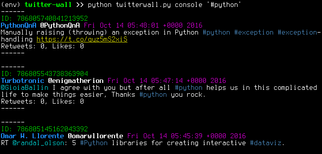

# twitter-wall
Simple application for displaying tweets containing string given by parameter. In console mode application fetches desired number of tweets and then periodicaly checks for any new tweets. In web mode it runs a web frontend writen in Flask. Frontend is live at http://ggljzr.pythonanywhere.com.

Application was created as part of Python course (https://github.com/cvut/MI-PYT, in Czech).

## Requirements
* Python3
* click
* requests
* Flask

##Usage

Fill in credentials in config.ini. You need to have a Twitter account and create a new app at https://apps.twitter.com/.

### Console mode

```
#shows available options
python3 twitterwall.py console --help
```

```
#starts fetching tweets containing '#python' in an infinte loop
#(quit with ctrl + c)
python3 twitterwall.py console '#python'
```




### Web mode

```
python3 twitterwall.py web
```

Runs Flask embedded web server in debug mode. Web frontend will be available on [localhost:5000](http://localhost:5000). Note that this should be used only for debugging purposes. When deploying in production you should use webserver like nginx or Apache and gateway interface like wsgi to serve the app.

Frontend itself just displays tweets fetched by [GET search/tweets](https://dev.twitter.com/rest/reference/get/search/tweets) Twitter API call. Query can be submitted via URL:

```
#fetches tweets with 'python' without retweets
http://localhost:5000/search/?query=python

#fetches tweets with 'python', with retweets
http://localhost:5000/search/?query=python&retweets=on
```

