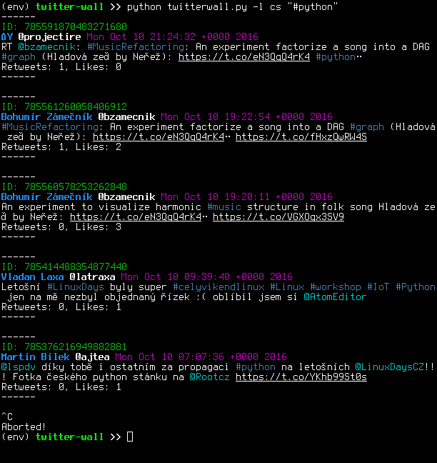

Pytwitter
=========

Simple application for displaying tweets containing string given by
parameter. In console mode application fetches desired number of tweets
and then periodicaly checks for any new tweets. In web mode it runs a
web frontend writen in Flask. Frontend is live at
http://ggljzr.pythonanywhere.com.

Application was created as part of Python course
(https://github.com/cvut/MI-PYT, in Czech).

Link to PyPi(testing) package:
https://testpypi.python.org/pypi/pytwitter.

Requirements
------------

-  Python3
-  click
-  requests
-  Flask

Usage
-----

You need to have a Twitter account and create a new app at
https://apps.twitter.com/. You will get key and secret which
are used to generate token to access your Twitter account via
API. For security purposes you may want to set this particular
app to have read access only (since application just fetches tweets).

Then you need to create config.ini file containing Twitter API key and
secret. Application looks for default config file in
``~/.config/pytwitter/config.ini``.

::

    #create default directory for config
    mkdir -p ~/.config/pytwitter/
    #copy example config in place
    cp config.ini.example ~/.config/pytwitter/config.ini

When you have ``config.ini`` in place, you just have to fill in API key and
secret instead of placeholders.

::

    [twitter]
    key = your-api-key
    secret = your-api-secret

    [github]
    #you can ignore this part

Alternatively you can use --config option to specify path to any custom
config file (in web or console mode).

::

    pytwitter web --config /path/to/your/config.ini

Console mode
~~~~~~~~~~~~

::

    #shows available options
    pytwitter console --help

::

    #starts fetching tweets containing '#python' in an infinte loop
    #(quit with ctrl + c)
    pytwitter console '#python'

Web mode
~~~~~~~~

::

    pytwitter web

Runs Flask embedded web server in debug mode. Web frontend will be
available on `localhost:5000 <http://localhost:5000>`__. Note that this
should be used only for debugging purposes. When deploying in production
you should use webserver like nginx or Apache and gateway interface like
wsgi to serve the app.

Frontend itself just displays tweets fetched by `GET
search/tweets <https://dev.twitter.com/rest/reference/get/search/tweets>`__
Twitter API call. Query can be submitted via URL:

::

    #fetches tweets with 'python' without retweets
    http://localhost:5000/search/?query=python

    #fetches tweets with 'python', with retweets
    http://localhost:5000/search/?query=python&retweets=on

Tests
-----

Application is distributed with a set of unit tests. You can run tests
with following commands:

::

    python3 setup.py test
    #or if you have already installed pytest
    pytest tests #note this is the only way to pass arguments to tests

Application package also contains set of recorded
`Betamax <http://betamax.readthedocs.io/en/latest/index.html>`__
sessions, so you run test even without having registered Twitter
account, or internet connection.

If you want to record your own sessions, you have to create a config.ini
file, as described `here <#usage>`__ and create ``AUTH_FILE``
environment variable:

::

    export AUTH_FILE='/path/to/your/config.ini'

Then you call tests with ``pytest`` and ``--record`` option:

::

    pytest tests --record

Test requirements
~~~~~~~~~~~~~~~~~

-  pytest
-  betamax

These should be collected automatically when running
``python3 setup.py test``

Documentation
-------------

You can generate project Documentation with `Sphinx <http://www.sphinx-doc.org/en/1.4.8/>`__. First make sure it is installed:

::
    
    #this only install Sphinx, since it is the only dependency
    pip install -r docs/requirements.txt

Then you can run ``make`` to generate html docs or run doctests:

::
    
    cd docs
    make html #this will create html documentation in docs/_build/html
    make doctest
